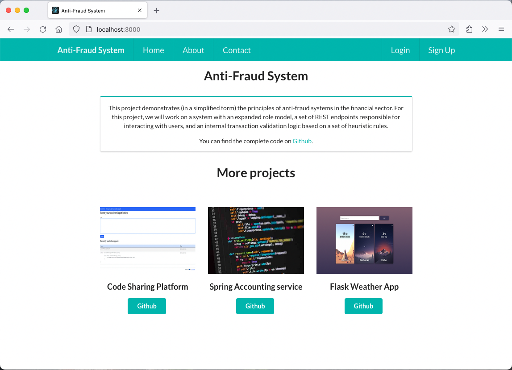

# React Anti-Fraud Frontend

This is a client side\* frontend for my [Anti-Fraud System](https://github.com/dan-koller/Spring-Anti-Fraud-System) project. It is a [React](https://reactjs.org/) single page application that uses [React Router](https://reacttraining.com/react-router/) for routing. For the UI, it uses [Semantic UI](https://react.semantic-ui.com/) and Axios for HTTP requests.



\*_There is a also a server side frontend available [here](https://github.com/dan-koller/Spring-Anti-Fraud-System/releases/) that is built with Thymeleaf. Note, that the server side frontend is not actively maintained and only available as additional download for the backend._

## Getting Started

These instructions will get you a copy of the project up and running on your local machine for development and testing purposes.

### Prerequisites

You will need to have [Node.js](https://nodejs.org/en/) installed on your machine as well as [npm](https://www.npmjs.com/).

### Installation

Clone the repository and install the dependencies.

```sh
git clone https://github.com/dan-koller/React-Anti-Fraud-Frontend.git
cd react-anti-fraud-frontend
npm install
```

## Available Scripts

In the project directory, you can run:

### `npm start`

Runs the app in the development mode.\
Open [http://localhost:3000](http://localhost:3000) to view it in your browser.

The page will reload when you make changes.\
You may also see any lint errors in the console.

### `npm test`

Launches the test runner in the interactive watch mode.\
See the section about [running tests](https://facebook.github.io/create-react-app/docs/running-tests) for more information.

### `npm run build`

Builds the app for production to the `build` folder.\
It correctly bundles React in production mode and optimizes the build for the best performance.

The build is minified and the filenames include the hashes.\
Your app is ready to be deployed!

See the section about [deployment](https://facebook.github.io/create-react-app/docs/deployment) for more information.

_If you want to learn more about React, check out the [React documentation](https://reactjs.org/)._

## Built With

-   [React](https://reactjs.org/) - The web framework used
-   [React Router](https://reacttraining.com/react-router/) - Routing
-   [Semantic UI](https://react.semantic-ui.com/) - UI
-   [Axios](https://github.com/axios/axios) - HTTP requests
